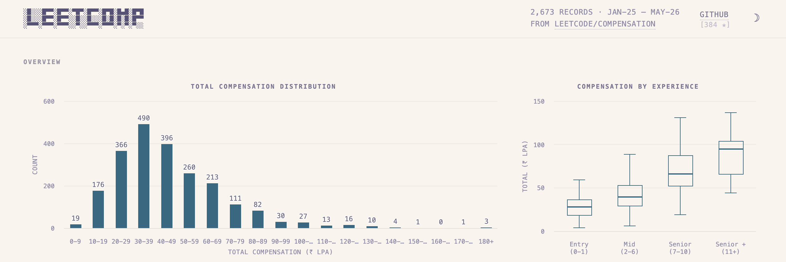

<div align="center">

<a href="https://0xku.github.io/leetcode-compensation/">
  <picture>
    <source media="(prefers-color-scheme: dark)" srcset="assets/banner-dark.png" />
    <source media="(prefers-color-scheme: light)" srcset="assets/banner-light.png" />
    
  </picture>
</a>

<br />
<br />

<a href="https://www.python.org/downloads/release/python-3130/"></a>
<a href="./LICENSE"></a>
<a href="https://0xku.github.io/leetcode-compensation/"></a>
<a href="./data/final_data.json"></a>

## Leetcode Compensation

</div>

***[Software engineer salaries in India](https://0xku.github.io/leetcode-compensation/), parsed from Leetcode compensation posts and refreshed automatically.***

Leetcode Compensation fetches salary posts from Leetcode discussion forums, parses and normalizes them into structured data using LLMs, and presents everything in a filterable dashboard. Data stays fresh through automated GitHub Action PRs that sync new posts on a regular cadence.

## Getting Started

Install uv from [Standalone Installers](https://docs.astral.sh/uv/getting-started/installation/) or from [PyPI](https://pypi.org/project/uv/):

```bash
uv sync  # Install all dependencies from pyproject.toml
```

## Updating Data

The project uses **LM Studio** by default (`LLM_PROVIDER=lm_studio`) with the `openai/gpt-oss-20b` model for:

- Parsing salaries, years of experience (YOE), and other compensation details from posts
- Normalizing fields like companies, roles, and locations into structured format

### Run sync

```bash
uv run leetcomp-sync
```

### Choose provider/model at runtime

```bash
uv run leetcomp-sync --provider llama_server --model unsloth/Qwen3.5-9B-GGUF
```

Supported providers:

- `lm_studio` (default)
- `llama_server` (also supports alias `llama-server`)
- `github_models` (requires `GITHUB_TOKEN`)
- `zai` (requires `ZAI_API_KEY`)

Optional env overrides:

- `LLM_PROVIDER`
- `LLM_MODEL`
- `LLM_BASE_URL`

### Example: llama.cpp server

```bash
/opt/homebrew/bin/llama-server \
  --hf-repo unsloth/Qwen3.5-9B-GGUF \
  --hf-file Qwen3.5-9B-Q4_K_M.gguf \
  --port 5000 \
  -c 65536

uv run leetcomp-sync --provider llama-server --model unsloth/Qwen3.5-9B-GGUF
```

## LLM Assistance

I've written all the data parsing logic in python by hand. Most of the prompts have been generated with the assistance of claude-sonnet-4.5 and pretty much all of the html file has been generated by claude-opus-4.5.
